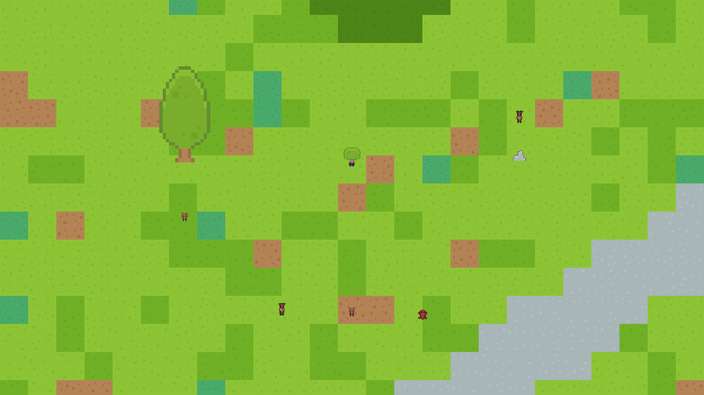
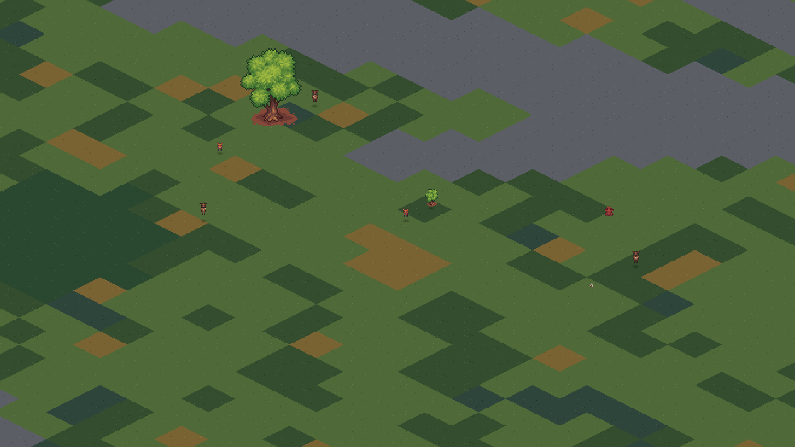

# P0 closure and P1 obstacle/depth verification — 2026-09-12

## Automated checks

- Godot headless suite: 454 checks, 0 failures
  - existing P0 and behavior suites: 406 checks
  - focused P1 obstacle/depth suite: 48 checks
- `jq empty data/config/*.json`: passed
- `bash -n scripts/dev/run_p0_matrix.sh`: passed
- `git diff --check`: passed

The P1 suite covers authoritative scenery identity, tree/stone swept collision,
bush slowdown and sight attenuation, inertia speed correction, tangential
sliding, closed corners, a blocked local waypoint, map boundaries, an enclosed
target, overlap separation near a solid, and stable depth ties between props,
living species and carcasses.

## P0 overview regression

The recorded runs use the large balanced preset, seed 1337, 720 measured frames
per view and the two shipped visual styles.

| Style | Frame p95 | Frame p99 | Measured speed | Rolling actual speed | Dropped time | Pending global/local |
| --- | ---: | ---: | ---: | ---: | ---: | ---: |
| topdown_kenney | 6.896 ms | 8.333 ms | 1.0048x | 1.0484x | 0 s | 1 / 0 |
| isometric_craftpix | 6.944 ms | 7.255 ms | 1.0852x | 0.9932x | 0 s | 0 / 0 |

These are the `overview` stages in [performance-topdown.json](performance-topdown.json)
and [performance-isometric.json](performance-isometric.json). The short herd and
pan stages remain in the raw reports as diagnostics; release acceptance uses the
complete matrix rather than treating those few-second samples as a soak result.

## P1 visual scenes

The visual fixtures use one authoritative scenery record per prop and arrange:

- an animal behind and another in front of a tree;
- an animal inside a passable bush;
- an animal behind a stone;
- two living species and a carcass at one painter depth.

The JSON records preserve the exact positions and emitted MultiMesh order.

## Deferred release gates

The 30-minute worker soak and the complete 3 map sizes x 5 population mixes x
2 styles x 3 repetitions matrix remain deferred to the final release gate. Run
them on an otherwise idle machine. They were not replaced by the short overview
regression above.

P1 did not change food coefficients, animal speeds, attack probabilities,
reproduction settings or ecology targets.
