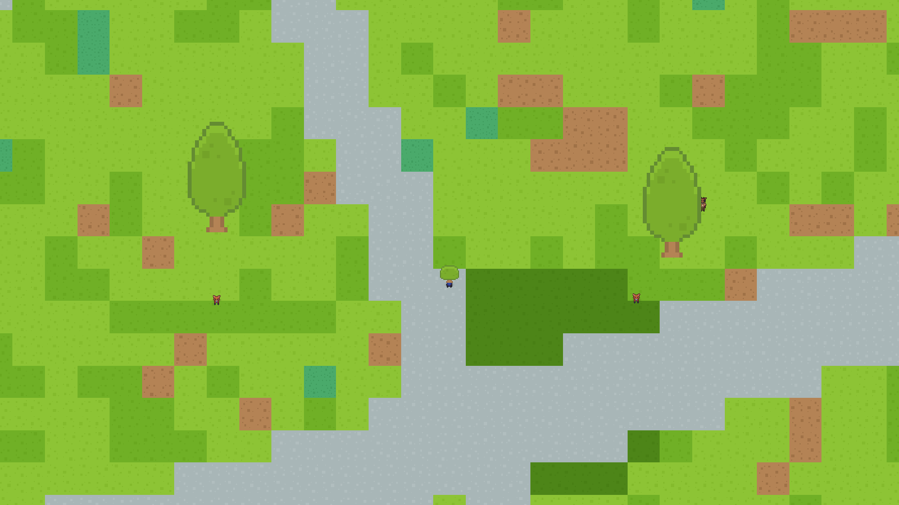
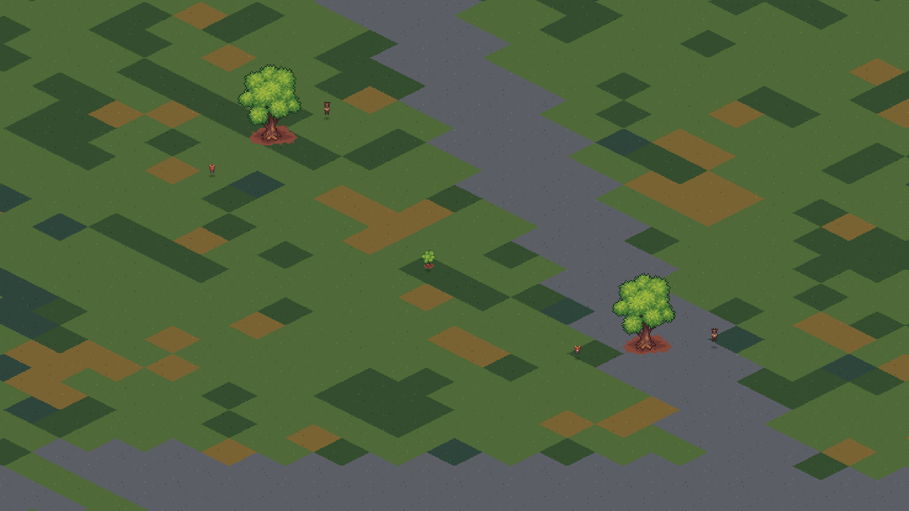

# P2 chase, escape, and lost-sight verification — 2026-09-12

## Automated behavior

- Full Godot headless suite: 502 checks, 0 failures.
- Focused P2 suite: 48 checks, 0 failures.
- Deterministic behavior audit: passed.

The P2 suite covers escape from multiple predators, minimum-distance progress,
cover selection, map bounds, route commitment and refresh triggers, last-seen
search, deterministic waypoints, inaccessible search points, reacquisition,
expiry, attack occlusion, fatigue transitions, telemetry, LOD priority, full v2
save round-trip, and defaults for older v2 records.

The standalone [behavior report](behavior.json) confirms that the escape target
increased the nearest-predator distance from 71.55 to 147.51 units, broke both
lines of sight, remained body-clear and stayed inside the map. Its lost-sight
fixture recorded exactly one search start, expiry and failure.

## P0 performance regression

The windowed runs use the large balanced preset, seed 1337, 180 warmup frames
and 720 measured frames per view at 1600x900.

| Style | Overview p95 | Overview p99 | Measured speed | Dropped time |
| --- | ---: | ---: | ---: | ---: |
| topdown_kenney | 12.38 ms | 17.31 ms | 1.0575x | 0.0021 s |
| isometric_craftpix | 8.33 ms | 13.27 ms | 1.0607x | 0.0163 s |

The longer 600-tick headless LOD run produced p95 38.57 ms and p99 49.92 ms,
with a 2.58x simulation capacity. Its global path queue started and ended at
zero, peaked at five pending requests, and its local queue remained zero.

The short isometric windowed sample ended on a tick with two global requests;
the longer headless sample demonstrates that the persistent queue drains rather
than grows. The complete matrix and 30-minute worker soak remain final release
gates after P3.

## Ecology baseline

The three-minute [seed 3 baseline](ecology-baseline.json) ended with 369
herbivores, 29 predators and 235 scavengers. It recorded 406 hunts, 73 successful
kills, three lost-sight searches and three reacquisitions. This is a diagnostic
starting point for P3; it is too short and uses one seed, so it is not a balance
acceptance result.

## Visual scenes

The fixtures show a fleeing animal behind a tree, a herd animal inside a bush,
an occluded hunter and a hunter moving toward a last-confirmed prey position.
Their JSON files include exact world positions and the emitted shared depth order.

P2 did not change base animal speeds, attack probability, food coefficients,
reproduction parameters, or ecological targets.
